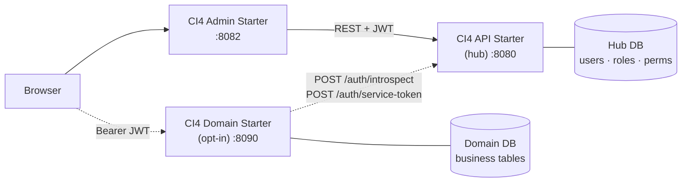
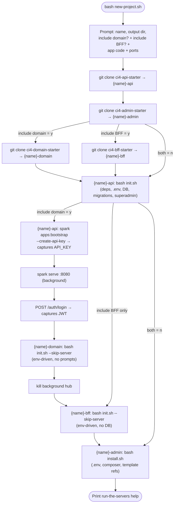

# CI4 Kickstart

An opinionated starting point for administrative applications built with CodeIgniter 4. Includes a REST API backend and a server-rendered admin frontend — both fully implemented and ready to customize.

## Who is this for

This is the stack I use for my own projects. It reflects how I structure CI4 applications: DTO-first, with granular RBAC, CRUD scaffolding, and a clean separation between the API hub and domain apps.

It's well-documented and free to use. That said: there's no support contract, no stability guarantee between major versions, and the conventions are opinionated toward my own workflow. If that fits yours, great.

## What's Inside

| Project | Description | Port |
|---------|-------------|------|
| [`ci4-api-starter`](https://github.com/dcardenasl/ci4-api-starter) | REST API backend — JWT auth, RBAC, CRUD scaffolding, OpenAPI docs | 8080 |
| [`ci4-admin-starter`](https://github.com/dcardenasl/ci4-admin-starter) | Admin frontend — Tailwind CSS, Alpine.js, all modules wired | 8082 |
| [`ci4-domain-starter`](https://github.com/dcardenasl/ci4-domain-starter) *(opt-in)* | Domain app template — owns business logic, delegates auth to the API hub | 8090 |
| [`ci4-bff-starter`](https://github.com/dcardenasl/ci4-bff-starter) *(opt-in)* | Backend-for-Frontend — stateless gateway over hub + domain for SPA / mobile clients | 8088 |

The generated API project is powered by two Packagist packages:

| Package | Type | Role |
|---------|------|------|
| [`dcardenasl/ci4-api-core`](https://packagist.org/packages/dcardenasl/ci4-api-core) | `require` | Runtime base classes — `ApiController`, `BaseCrudService`, `BaseRequestDTO`, `BaseAuditableModel`, etc. |
| [`dcardenasl/ci4-api-scaffolding`](https://packagist.org/packages/dcardenasl/ci4-api-scaffolding) | `require-dev` | CRUD scaffolding engine — `php spark make:crud`, `vendor/bin/make-crud.sh`, `module:check` |

**Architecture:**



Solid arrows = HTTP traffic on every request. Dashed = setup-time or cached calls (introspect TTL 60s, service-token cached until expiry).

## Quick Start

### Prerequisites

- PHP 8.2+
- Composer
- Node.js + npm
- MySQL (local or Docker)
- Git

#### Windows

`new-project.sh` requires a Bash environment. On Windows, use one of:

- **WSL 2** (recommended) — install via `wsl --install` in PowerShell, then run all commands inside the WSL terminal
- **Git Bash** — ships with [Git for Windows](https://git-scm.com/download/win); open "Git Bash" and run commands there

Once inside WSL or Git Bash, the setup and all subsequent development commands work identically to Linux/macOS.

> **Note:** When using WSL 2, run the project files inside the WSL filesystem (e.g. `~/projects/`) rather than a mounted Windows drive (`/mnt/c/...`). File I/O on mounted drives is significantly slower and can cause issues with `composer install` and `npm`.

### Create a new project

```bash
git clone https://github.com/dcardenasl/ci4-kickstart.git
cd ci4-kickstart
bash new-project.sh
```

The script will:
1. Ask for a project name, output directory, and whether to include a domain starter and/or a BFF starter
2. Clone the sub-projects from GitHub (no git history, no vendor files)
3. Initialize fresh git repos for each
4. Walk you through API setup: database config, migrations, superadmin
5. **If domain included:** register the application in the hub via `apps:bootstrap --create-api-key`, capture the X-App-Key, start the hub in background, capture a superadmin JWT via login, run domain `init.sh --skip-server` non-interactively, stop the hub
6. **If BFF included:** run BFF `init.sh --skip-server` with `BFF_HUB_URL`, `BFF_DOMAIN_URL` and `BFF_ALLOWED_ORIGINS` pre-populated (no DB, no hub bootstrap — the BFF is stateless and forward-only)
7. Walk you through Admin setup: API URL, ports, app name
8. Print the commands to start all processes

Total time: ~5 minutes (mostly waiting on `composer install`); add ~30s per opt-in starter.

### What `new-project.sh` does, step by step



If anything fails mid-flow, `cleanup_on_error` kills the background hub (if any) and `rm -rf` only the directories that the current run created — nothing pre-existing is touched.

## What the setup scripts do

### API setup (`init.sh`)
- Installs Composer dependencies
- Creates `.env` from `.env.example` and generates JWT + encryption keys
- Creates the main and test databases
- Runs all migrations
- Optionally creates a superadmin account
- Generates the OpenAPI schema

### Admin setup (`install.sh`)
- Replaces all template references (`ci4-api-starter` → your API name)
- Configures `.env` with your API URL, app name, and port
- Optionally installs Composer dependencies

## Running the project

After setup, open three terminals:

```bash
# Terminal 1 — API server
cd my-app-api && php spark serve

# Terminal 2 — Admin server
cd my-app-admin && php spark serve --port 8082

# Terminal 3 — Tailwind CSS watcher
cd my-app-admin && npm run dev:css

# Terminal 4 (optional) — Domain server
cd my-app-domain && php spark serve --port 8090

# Terminal 5 (optional) — BFF server
cd my-app-bff && php spark serve --port 8088
```

Then open [http://localhost:8082](http://localhost:8082) and log in with your superadmin credentials.

## Adding features

**New API endpoint:**

Scaffolding is provided by [`dcardenasl/ci4-api-scaffolding`](https://packagist.org/packages/dcardenasl/ci4-api-scaffolding) (installed as `require-dev` in the generated API project).

```bash
cd my-app-api
bash vendor/bin/make-crud.sh Product Catalog \
  'name:string:required|searchable,price:decimal:required|filterable' \
  yes
php spark module:check Product --domain Catalog
php spark migrate
pkill -f 'spark serve'; php spark serve --port 8080 &
php spark swagger:generate
```

**New Admin module:** See [`ci4-admin-starter` documentation](https://github.com/dcardenasl/ci4-admin-starter#claude) for the module structure.

## Documentation

- **ci4-api-starter** — See [API repository](https://github.com/dcardenasl/ci4-api-starter) for architecture, DTO-first patterns, testing, and detailed setup guides
- **ci4-admin-starter** — See [Admin repository](https://github.com/dcardenasl/ci4-admin-starter) for architecture, ApiClient, modules, frontend design, and deployment guides
- [`CLAUDE.md`](CLAUDE.md) — System-wide overview for AI-assisted development (local guide when working in this kit)
